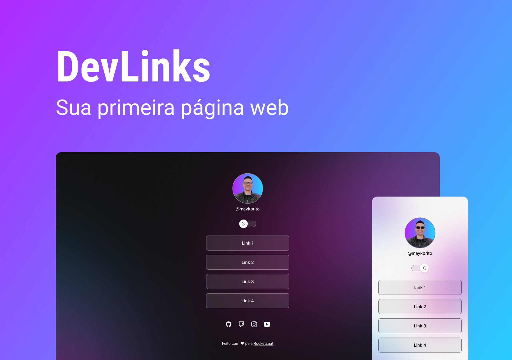

<h1 align="center"> ProfileLinks </h1>

Programa exclusivo e gratuito, promovido pela Rocketseat para ensino de tecnologias WEB.  

  <a href="#-tecnologias">Tecnologias</a>&nbsp;&nbsp;&nbsp;|&nbsp;&nbsp;&nbsp;
  <a href="#-projeto">Projeto</a>&nbsp;&nbsp;&nbsp;|&nbsp;&nbsp;&nbsp;
  <a href="#memo-licença">Licença</a>&nbsp;&nbsp;&nbsp;|&nbsp;&nbsp;&nbsp;

  

 

  

## 🚀 Tecnologias

Esse projeto foi desenvolvido com as seguintes tecnologias:

- HTML e CSS
- JavaScript
- Git e Github
- Figma

<h1 align="center">## 💻 Projeto </h1>

Projeto de um cartão de visitas como um perfil, onde encontra-se minhas redes sociais e demais links.

Aprendi muito sobre controle de caixas, flex box etc. Sendo parte eseencial do projeto, a responsividade.

- [Acesse o projeto finalizado, online](https://github.com/brunoalvesvidal/Projeto-Profile.git)

## :memo: Licença

Esse projeto está sob a licença MIT.
# ProfileLinks
